# DAW GROUP 9

  

Main project of ***Desarrollo de Aplicaciones Web*** subject.

  

Rey Juan Carlos University 2020/2021

  

Web app for a gaming center called ***Ultra Game Center***

  

## PHASE 0: Project attributes

  

## Developer Team

| Name	| Email	| User |
|-------|-------|--------|
| Miguel Cendrero Ortega	| m.cendrero.2017@alumnos.urjc.es	| micenor|
| Jesús Élez Sánchez	| j.elez.2017@alumnos.urjc.es	| Elez25 |
| Rodrigo Díez Alonso		| r.dieza.2017@alumnos.urjc.es	| rodri666a|
| Rodrigo de Siqueira-Lima Perez-Moreno	| r.desiqueiralima@alumnos.urjc.es	| roddesiqueira|
| Alejandro Fernández San Román		| a.fernandezsan.2018@alumnos.urjc.es	| santo2927|

### Project description

**Entities:**

- Event: date, location, game, prize, likes (nº of people attending).

- Booking: number of table, date, hour. 

- Gaming table: number, status, type.

- User

  

**User's role and permissions:**

- Administrator users: graphs, upload merch, events, etc.

- Registered user: profile and preferences managment, join events and purchase merchandising; apart from booking gaming tables.

- Visitors: browse the website and book a gaming table.

**Images:**

- Images related to the merchandising / events.

- Profile image of the users.

  

**Graphs:**

- Graphs which represent the number of users that are going to attend an event.

- Graphs which represent the capacity of the gaming tables.

**Complementary tecnology:**

- Purchases' confirmation email.

- Event location by google maps.

- Login with Google (maybe)

**Advanced query or algorithm:**

- Based on the events that the user has liked, those events which users similar to him have also liked will appear first.

## PHASE 1: Website structure by HTML and CSS

  
**Table of contents**:
  - Home page: presentation of the website.
  
  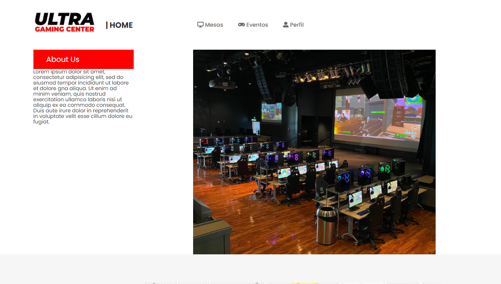
  
  - Reservation: allows users to book a table.
  
  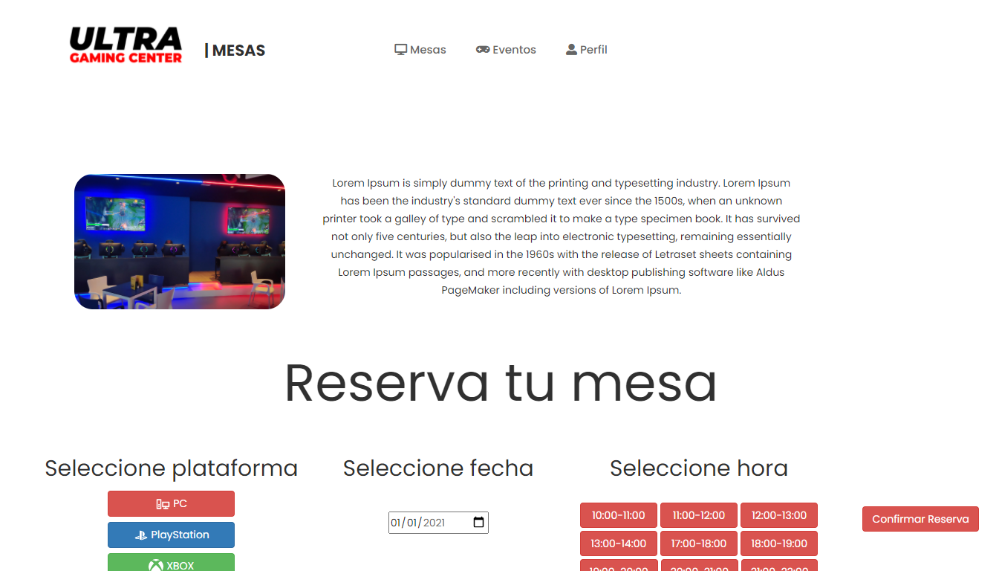
  
  - Events: shows all events.
  
  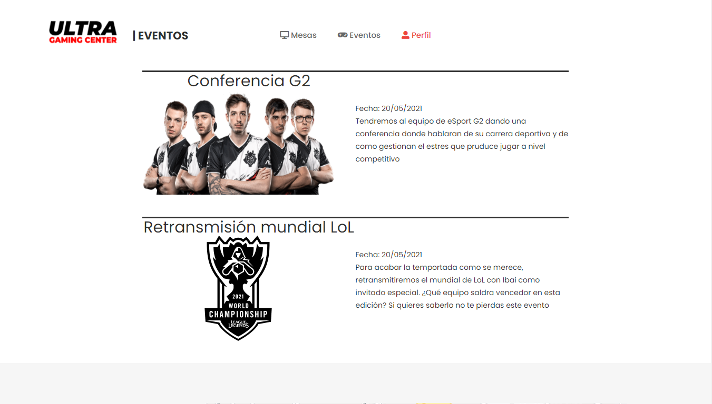
  
  - Single event: shows the information of a specific event.
  
  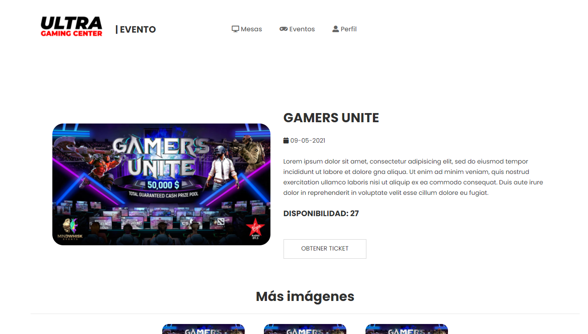
 
  - Register: allows the non-registered users to create a profile.
  
  
  
  - Login: allows the visitor to log in the website.
  
  
  
  - User profile: allows the users to see and modify their profile.
  
  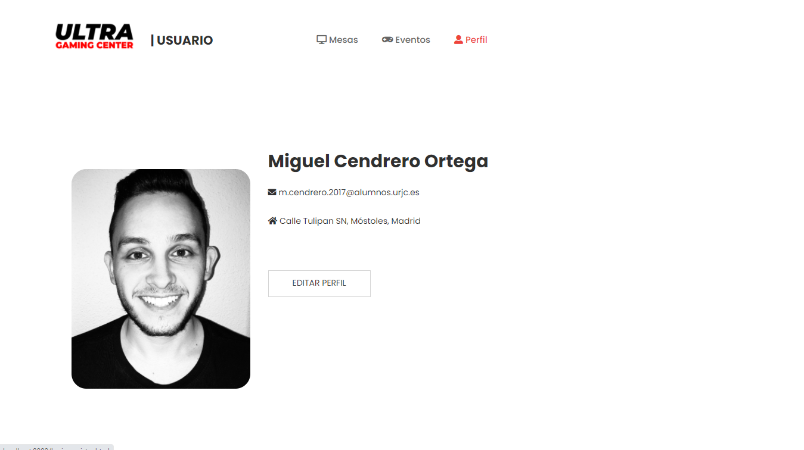
  
  - Admin events: allows the admins to see info about their events.
  
  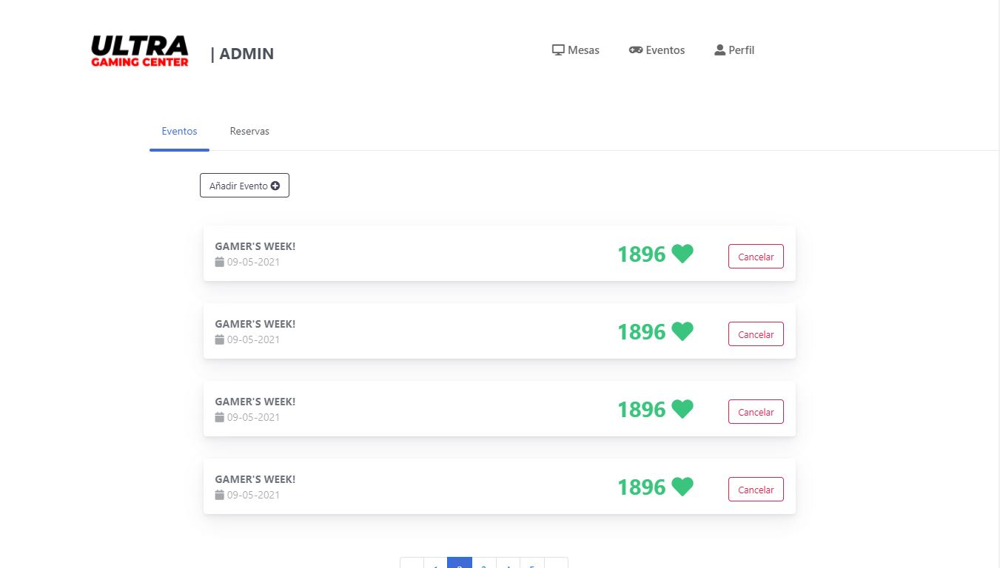 
  
  - Admin reservation: allows the admins to see all the reservations and interact with them.
  
  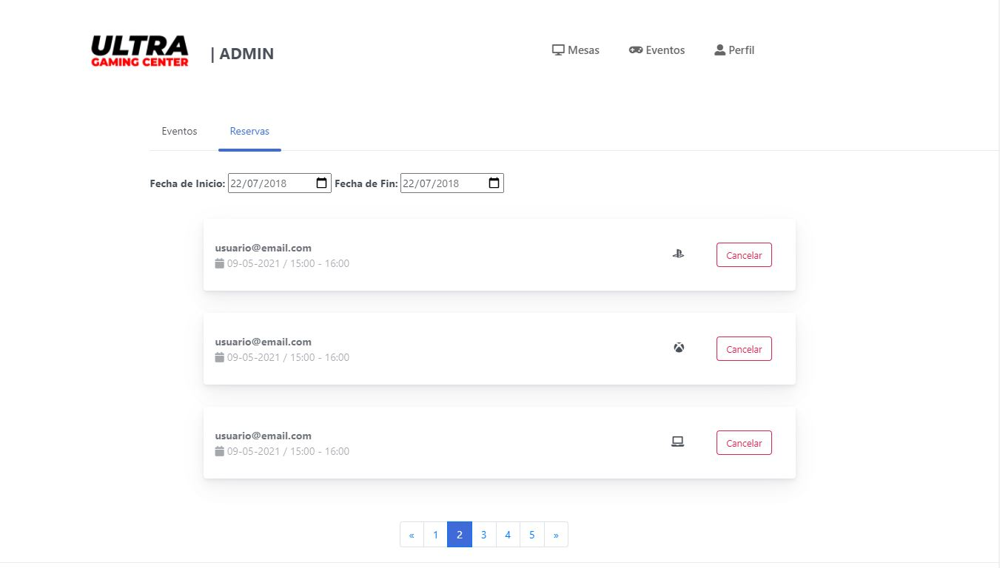
  
  - Graphs page: allows the admins to see graphical information about their events.
  
  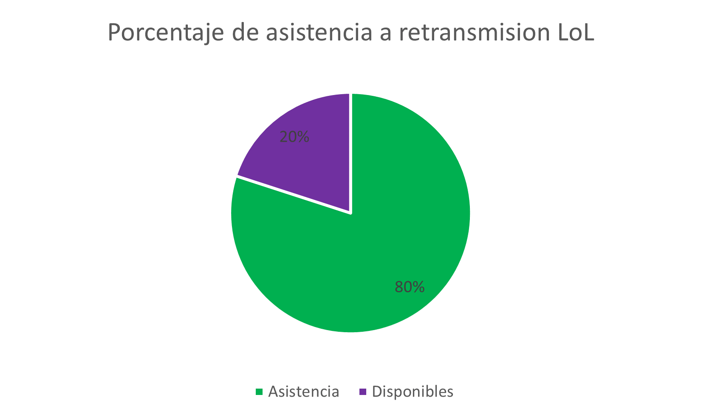
  
  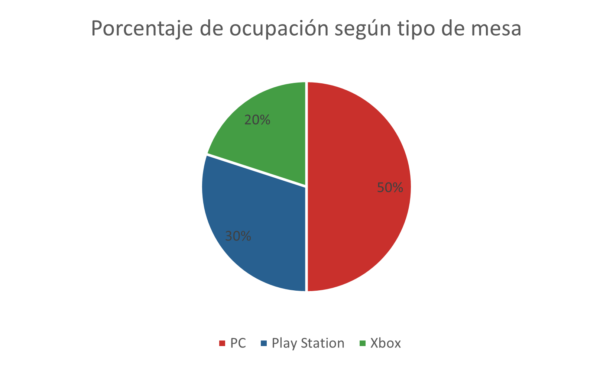
  
  - Footer: shows the visitor contact information and a map of our location.
  
  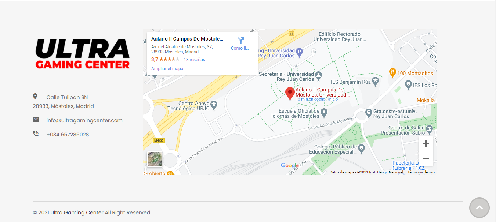
  
**Navigation Diagram**: 

  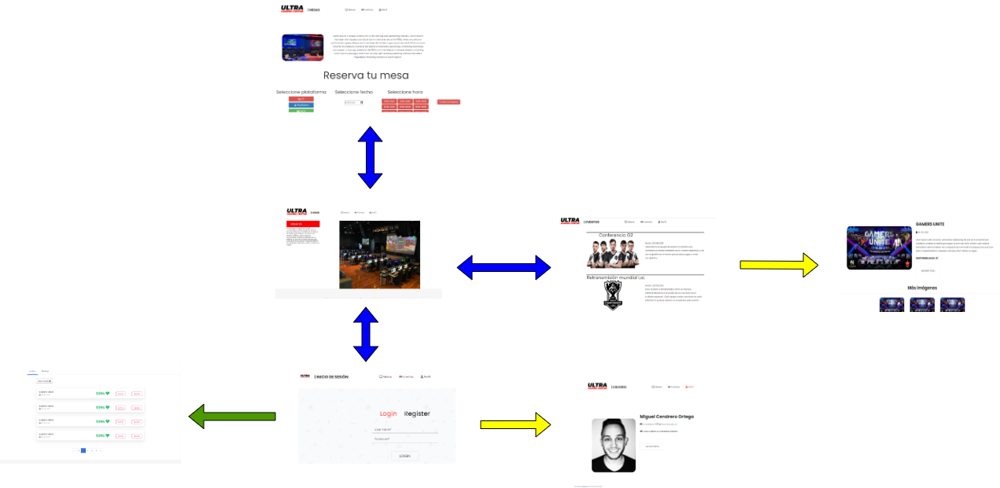

