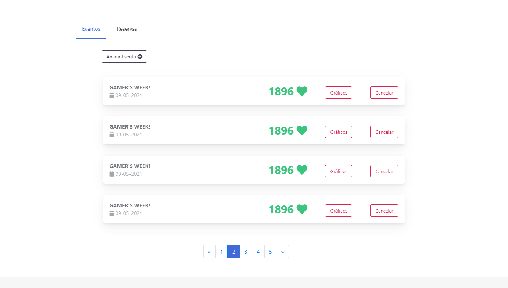
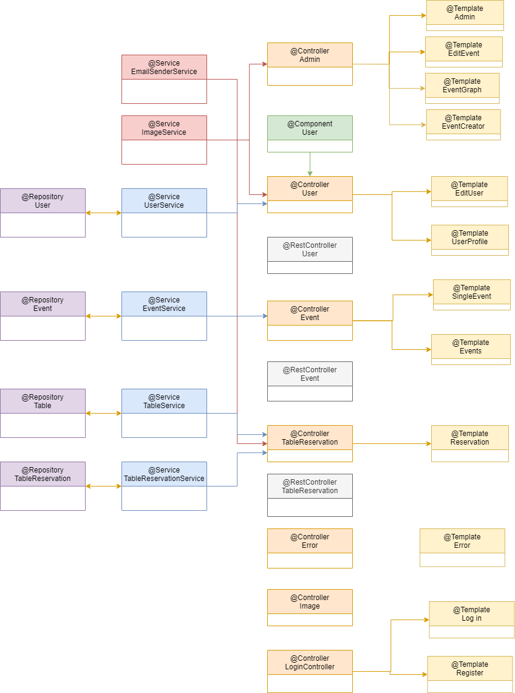
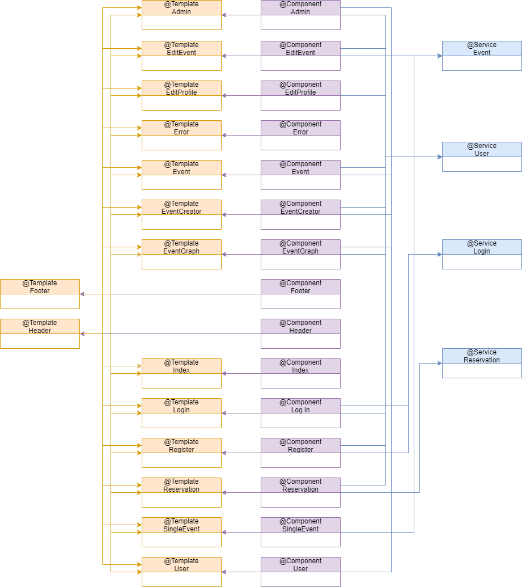

# DAW GROUP 9 :video_game:

  

Main project of ***Desarrollo de Aplicaciones Web*** subject.

  

Rey Juan Carlos University 2020/2021

  

Web app for a gaming center called ***Ultra Game Center***

  

## PHASE 0: Project attributes

  

## Developer Team

| Name	| Email	| User |
|-------|-------|--------|
| Miguel Cendrero Ortega	| m.cendrero.2017@alumnos.urjc.es	| micenor|
| Jesús Élez Sánchez	| j.elez.2017@alumnos.urjc.es	| Elez25 |
| Rodrigo Díez Alonso		| r.dieza.2017@alumnos.urjc.es	| rodri666a|
| Rodrigo de Siqueira-Lima Perez-Moreno	| r.desiqueiralima@alumnos.urjc.es	| roddesiqueira|
| Alejandro Fernández San Román		| a.fernandezsan.2018@alumnos.urjc.es	| santo2927|

### Project description

**Entities:**

- Event: date, location, game, prize, likes (nº of people attending).

- Booking: number of table, date, hour. 

- Gaming table: number, status, type.

- User

  

**User's role and permissions:**

- Administrator users: graphs, upload merch, events, etc.

- Registered user: profile and preferences managment, join events and purchase merchandising; apart from booking gaming tables.

- Visitors: browse the website and book a gaming table.

**Images:**

- Images related to the merchandising / events.

- Profile image of the users.

  

**Graphs:**

- Graphs which represent the number of users that are going to attend an event.

- Graphs which represent the capacity of the gaming tables.

**Complementary tecnology:**

- Purchases' confirmation email.

- Event location by google maps.

- Login with Google (maybe)

**Advanced query or algorithm:**

- Based on the events that the user has liked, those events which users similar to him have also liked will appear first.

## PHASE 1: Website structure by HTML and CSS

  
**Table of contents**:
  - Home page: presentation of the website.
  
  
  
  - Reservation: allows users to book a table.
  
  
  
  - Events: shows all events.
  
  
  
  - Single event: shows the information of a specific event.
  
  
 
  - Register: allows the non-registered users to create a profile.
  
  
  
  - Login: allows the visitor to log in the website.
  
  
  
  - User profile: allows the users to see and modify their profile.
  
  
  
  - Admin events: allows the admins to see info about their events.
  
   
  
  - Admin reservation: allows the admins to see all the reservations and interact with them.
  
  
  
  - Graphs page: allows the admins to see graphical information about their events.
  
  
  
  
  
  - Footer: shows the visitor contact information and a map of our location.
  
  
  
**Navigation Diagram**: 

  
  
  

## PHASE 2: Web with HTML generated in server and AJAX

### Development direction:

- Repository: https://github.com/CodeURJC-DAW-2020-21/webapp9
- Development tools: Visual Studio Code, Spring Tool Suite4
- Dependencies: Mail, MySQL connector
- Follow the next steps to execute the files:
    1. Open the project with your development tool
    2. Start a MySQL service in the local host in the port 3304 with a schema called "test"
    3. Start running the application 
    4. Enter from a browser to: https://localhost:8443
    

### Database structure:

### Classes and templates diagram

### Navigation Diagram (Updated)

### Participation

**Miguel Cendrero**

-  Completed tasks: Created some entities, added the error page, listed events template (with pagination), most of the work in admin template and visual fixtures.

- 5 most significant commits:
  1. [List all events with mustache](https://github.com/CodeURJC-DAW-2020-21/webapp9/commit/b193aaa719bc9943d57a7f7729e1364e447d1780)
  2. [Error page + css](https://github.com/CodeURJC-DAW-2020-21/webapp9/commit/e8b1ae7d89c10be01680f203fcd4bc0618b8803b)
  3. [Delete reservation/event](https://github.com/CodeURJC-DAW-2020-21/webapp9/commit/3a812ecfa0115a03b6c3db24605e1e114ca4e888)
  4. [Pagination works](https://github.com/CodeURJC-DAW-2020-21/webapp9/commit/10842d7ea0bf367631360e170fe15a005db714c4)
  5. [Reservations / events graphs](https://github.com/CodeURJC-DAW-2020-21/webapp9/commit/48c1e41ef14f3c1f6543ba9ffacbf7b28644857d)
  
- 5 files with participation:
  1. [404.html](https://github.com/CodeURJC-DAW-2020-21/webapp9/blob/main/ultragamecenter/src/main/resources/templates/404.html)
  2. [UserRepository.java](https://github.com/CodeURJC-DAW-2020-21/webapp9/blob/main/ultragamecenter/src/main/java/urjc/ugc/ultragamecenter/Repositories/UserRepository.java)
  3. [AdminTemplate.html](https://github.com/CodeURJC-DAW-2020-21/webapp9/blob/main/ultragamecenter/src/main/resources/templates/admin.html)
  4. [Events.html](https://github.com/CodeURJC-DAW-2020-21/webapp9/blob/main/ultragamecenter/src/main/resources/templates/events.html)
  5. [Both graphs templates]

**Rodrigo Díez**

-  Completed tasks: Updated Entities, added reservation page, most of the work in reservation feature and database.

- 5 most significant commits:
  1. Reservation semi-done
  2. Reservation feature
  3. Updated names of bd and updated entities
  4. User model updated
  5. Updated event and initdatabase
  
- 5 files with participation:
  1. [Initdatabase](https://github.com/CodeURJC-DAW-2020-21/webapp9/blob/main/ultragamecenter/src/main/java/urjc/ugc/ultragamecenter/InitDataBase.java)
  2. [Controllers](https://github.com/CodeURJC-DAW-2020-21/webapp9/tree/main/ultragamecenter/src/main/java/urjc/ugc/ultragamecenter/Controllers)
  3. [Repositories](https://github.com/CodeURJC-DAW-2020-21/webapp9/tree/main/ultragamecenter/src/main/java/urjc/ugc/ultragamecenter/Repositories)
  4. Entities
  5. [ReservationTemplate.html](https://github.com/CodeURJC-DAW-2020-21/webapp9/blob/main/ultragamecenter/src/main/resources/templates/ReservationTemplate.html)

**Jesús**

-  Completed tasks: Add event images, edit profile image and data base initialized.

- 5 most significant commits:
  1. Data base initialized
  2. Add images on create events
  3. Change user's profile picture
  4. Init pagination
  5. Some merge fixed
  
- 5 files with participation:
  1. [ImageService](https://github.com/CodeURJC-DAW-2020-21/webapp9/blob/main/ultragamecenter/src/main/java/urjc/ugc/ultragamecenter/Services/ImageService.java)
  2. [UserController](https://github.com/CodeURJC-DAW-2020-21/webapp9/blob/main/ultragamecenter/src/main/java/urjc/ugc/ultragamecenter/Controllers/UserController.java)
  3. [InitDatabase](https://github.com/CodeURJC-DAW-2020-21/webapp9/blob/main/ultragamecenter/src/main/java/urjc/ugc/ultragamecenter/InitDataBase.java)
  4. [Event](https://github.com/CodeURJC-DAW-2020-21/webapp9/blob/main/ultragamecenter/src/main/java/urjc/ugc/ultragamecenter/Models/Event.java)
  5. [event creator](https://github.com/CodeURJC-DAW-2020-21/webapp9/blob/main/ultragamecenter/src/main/resources/templates/EventCreatorTemplate.html)

**Alejandro**

-  Completed tasks: Added email service, added advanced algorithm

- 5 most significant commits:
  1. [Some organizationd + UserController/UserComponent](https://github.com/CodeURJC-DAW-2020-21/webapp9/commit/b5e30f76104701f4de6c8d041c662e0d880985e6)
  2. [Created tabletype and EventLavelType + added algorithm of affinity with event lavels](https://github.com/CodeURJC-DAW-2020-21/webapp9/commit/8ba9693e43c2042e5a1b71d3e5548d85d0406c9a)
  3. [Adding methods created + updated recomendation algorithm](https://github.com/CodeURJC-DAW-2020-21/webapp9/commit/e0e6457bdf95ca533741df264e00bfe15560bfb3)
  4. [login-register working](https://github.com/CodeURJC-DAW-2020-21/webapp9/commit/b29ab8e0eab5d21c9ff9dfb2bd8c84bb9f7f5e45)
  5. [Avanced Algoritm working](https://github.com/CodeURJC-DAW-2020-21/webapp9/commit/70098d3e19346e3bb1a81f6341f7190501fbcd21)
  
- 5 files with participation:
  1. [UserComponent.java](https://github.com/CodeURJC-DAW-2020-21/webapp9/blob/main/ultragamecenter/src/main/java/urjc/ugc/ultragamecenter/Components/UserComponent.java)
  2. [UserController.java](https://github.com/CodeURJC-DAW-2020-21/webapp9/blob/main/ultragamecenter/src/main/java/urjc/ugc/ultragamecenter/Controllers/UserController.java)
  3. [EmailSenderService.java](https://github.com/CodeURJC-DAW-2020-21/webapp9/blob/main/ultragamecenter/src/main/java/urjc/ugc/ultragamecenter/Services/EmailSenderService.java)
  4. [EventService.java](https://github.com/CodeURJC-DAW-2020-21/webapp9/blob/main/ultragamecenter/src/main/java/urjc/ugc/ultragamecenter/Services/EventService.java)
  5. [User.java](https://github.com/CodeURJC-DAW-2020-21/webapp9/blob/main/ultragamecenter/src/main/java/urjc/ugc/ultragamecenter/Models/User.java)

**Rodrigo de Siqueira**

-  Completed tasks: Spring Security Configuration, made login controller, mustache templates and general fixes.

- 5 most significant commits:
  1. Reservation semi-done
  2. Reservation feature
  3. Updated names of bd and updated entities
  4. User model updated
  5. Updated event and InitDatabase
  
- 5 files with participation:
  1. [SecurityConfig](https://github.com/CodeURJC-DAW-2020-21/webapp9/blob/main/ultragamecenter/src/main/java/urjc/ugc/ultragamecenter/Security/SecurityConfig.java)
  2. [Login Controller](https://github.com/CodeURJC-DAW-2020-21/webapp9/blob/main/ultragamecenter/src/main/java/urjc/ugc/ultragamecenter/Controllers/LoginController.java)
  3. [User Controller](https://github.com/CodeURJC-DAW-2020-21/webapp9/blob/main/ultragamecenter/src/main/java/urjc/ugc/ultragamecenter/Controllers/UserController.java)
  4. [Admin Controller](https://github.com/CodeURJC-DAW-2020-21/webapp9/blob/main/ultragamecenter/src/main/java/urjc/ugc/ultragamecenter/Controllers/AdminController.java)
  5. [login.html](https://github.com/CodeURJC-DAW-2020-21/webapp9/blob/main/ultragamecenter/src/main/resources/templates/login.html)

## PHASE 3: API REST to the web application and docker deployment 

- [OpenAPI.html](https://raw.githack.com/CodeURJC-DAW-2020-21/webapp9/main/ultragamecenter/api-docs/api-docs.html) and [OpenApi.yaml](https://github.com/CodeURJC-DAW-2020-21/webapp9/blob/main/ultragamecenter/api-docs/api-docs.yaml) with information about the REST API.

### Executing docker-compose:
Docker allows the users to run our web application without having anything installed. Follow these steps: 

  - Go to ./docker
  - Run this command: docker-compose up

Only with that command the containers are started.

To stop the containers just run:
  - docker-compose down

### Building the image

To create the image, you just have to launch the script.bat file.

- Go to ./docker
- Run this command: start script.bat

### Class Diagram:

### Participation: 

**Miguel Cendrero**

-  Completed tasks: Edited most of the readme and developed APIs (and Postman).

- 5 most significant commits:
  1. [Deleted repositories from controllers | added services instead](https://github.com/CodeURJC-DAW-2020-21/webapp9/commit/41de231f5498b6ff823e768073060e90be3a1ec1)
  2. [User](https://github.com/CodeURJC-DAW-2020-21/webapp9/commit/26d5463a274f3821c22f99ab5f47147e402ffc9f)
  3. [TableReservation, Event, Table Rest Controllers](https://github.com/CodeURJC-DAW-2020-21/webapp9/commit/b46adbea1ae69e52eaba5f7867b660c88ace7295)
  4. [fixes in apis](https://github.com/CodeURJC-DAW-2020-21/webapp9/commit/1e0455bc7f86ec5b0a761ea42da592d998eaf8e7)
  5. [changes in user rest controller](https://github.com/CodeURJC-DAW-2020-21/webapp9/commit/20339f407dc8ff8dfd73ce00c3d2624775dd780e)
  
- 5 files with participation:
  1. [EventService.java](https://github.com/CodeURJC-DAW-2020-21/webapp9/blob/api/ultragamecenter/src/main/java/urjc/ugc/ultragamecenter/Services/EventService.java)
  2. [README.md](https://github.com/CodeURJC-DAW-2020-21/webapp9/blob/main/README.md)
  3. [EventRestController.java](https://github.com/CodeURJC-DAW-2020-21/webapp9/blob/api/ultragamecenter/src/main/java/urjc/ugc/ultragamecenter/rest_controllers/EventRestController.java)
  4. [UserRestController.java](https://github.com/CodeURJC-DAW-2020-21/webapp9/blob/api/ultragamecenter/src/main/java/urjc/ugc/ultragamecenter/rest_controllers/UserRestController.java)
  5. [UserService.java](https://github.com/CodeURJC-DAW-2020-21/webapp9/blob/api/ultragamecenter/src/main/java/urjc/ugc/ultragamecenter/Services/UserService.java)

**Jesús Élez**

-  Completed tasks: Docker file, make form visible, docker scripts.

- 5 most significant commits:
  1. [sql container linked with app container](https://github.com/CodeURJC-DAW-2020-21/webapp9/commit/46e713c06329d3714897f1aa35ba7c39202c3d1d)
  2. [styles added to edit profile](https://github.com/CodeURJC-DAW-2020-21/webapp9/commit/a894c87a0681255937f877ca363d58b83eaa5365)
  3. [Create event form visible](https://github.com/CodeURJC-DAW-2020-21/webapp9/commit/b86f2d66e40fd9b02fc83d5fcf7d7aebd624b8ed)
  4. [Date debug solved](https://github.com/CodeURJC-DAW-2020-21/webapp9/commit/d46401a70b72fe856673905b8050d89f040087db)
  5. [Create Docker script](https://github.com/CodeURJC-DAW-2020-21/webapp9/commit/e86bbfdf1ab230c148c6360e72853458e38a8864)
  
- 5 files with participation:
  1. [EventCreatorTemplate.html](https://github.com/CodeURJC-DAW-2020-21/webapp9/blob/main/ultragamecenter/src/main/resources/templates/EventCreatorTemplate.html)
  2. [custom.css](https://github.com/CodeURJC-DAW-2020-21/webapp9/blob/main/ultragamecenter/src/main/resources/static/css/custom.css)
  3. [login-register.css](https://github.com/CodeURJC-DAW-2020-21/webapp9/blob/main/ultragamecenter/src/main/resources/static/css/login-register.css)
  4. [Docker script](https://github.com/CodeURJC-DAW-2020-21/webapp9/blob/api/ultragamecenter/docker/script.bat)
  5. [EditProfileTemplate.html](https://github.com/CodeURJC-DAW-2020-21/webapp9/blob/main/ultragamecenter/src/main/resources/templates/EditProfileTemplate.html)

**Alejandro**

-  Completed tasks: Centralized Web and API controllers, created API geters, puts and API models.

- 5 most significant commits:
  1. [little changes to api typing](https://github.com/CodeURJC-DAW-2020-21/webapp9/commit/d3dc87ba2deb24e213a7c847e9b4dde774bb0fc9)
  2. [Event Edit fixed](https://github.com/CodeURJC-DAW-2020-21/webapp9/commit/fb811dda0e03ca16dbf1620a4e729a52e410a165 )
  3. [Setting nice ok or bad request](https://github.com/CodeURJC-DAW-2020-21/webapp9/commit/f7f2945a41c5bb7f76b2f9f3f5c21e1c75e75414 )
  4. [Little bit changes](https://github.com/CodeURJC-DAW-2020-21/webapp9/commit/fd8016ed05455118743e6b6789fa7fa7d9e9187c )
  5. [Centralizing creaing and updating models](https://github.com/CodeURJC-DAW-2020-21/webapp9/commit/5984426d3d0bd111959ab5dec2635c504694c50a )
  
- 5 files with participation:
  1. [APImodels](https://github.com/CodeURJC-DAW-2020-21/webapp9/blob/main/ultragamecenter/src/main/java/urjc/ugc/ultragamecenter/api_models)
  2. [EventRestController.java](https://github.com/CodeURJC-DAW-2020-21/webapp9/blob/main/ultragamecenter/src/main/java/urjc/ugc/ultragamecenter/rest_controllers/EventRestController.java)
  3. [EmailSenderService.java](https://github.com/CodeURJC-DAW-2020-21/webapp9/blob/main/ultragamecenter/src/main/java/urjc/ugc/ultragamecenter/rest_controllers/UserTestController.java)
  4. [EventService.java](https://github.com/CodeURJC-DAW-2020-21/webapp9/blob/main/ultragamecenter/src/main/java/urjc/ugc/ultragamecenter/Services/EventService.java)
  5. [UserService.java](https://github.com/CodeURJC-DAW-2020-21/webapp9/blob/main/ultragamecenter/src/main/java/urjc/ugc/ultragamecenter/Services/UserService.java)

 **Rodrigo Díez**

-  Completed tasks: docker file, docker compose, upload images on docker and image push to dockerhub.

- 5 most significant commits:
  1. [Upload images on docker working correctly](https://github.com/CodeURJC-DAW-2020-21/webapp9/commit/715794cd04fdec87675876b9654e30c0b92ce80c)
  2. [Docker-Compose with default constructor User](https://github.com/CodeURJC-DAW-2020-21/webapp9/commit/fafe54016bb018745149cdbd571c90f032eb8b2e )
  3. [Docker compose use dockerhub image](https://github.com/CodeURJC-DAW-2020-21/webapp9/commit/8b07ed2339bd89838d53589b9656222177b016d0 )
  4. [Docker compose test](https://github.com/CodeURJC-DAW-2020-21/webapp9/commit/14645bdf034b23d984521b084b36cd2b976d0c2e )
  5. [Docker-compose works without default user constructor](https://github.com/CodeURJC-DAW-2020-21/webapp9/commit/14e52ad5e06138e3333d2d89b64f8e8ab5681204 )
  
- 5 files with participation:
  1. [dockerFile](https://github.com/CodeURJC-DAW-2020-21/webapp9/blob/api/ultragamecenter/docker/Dockerfile)
  2. [docker-compose.yml](https://github.com/CodeURJC-DAW-2020-21/webapp9/blob/api/ultragamecenter/docker/docker-compose.yml)
  3. [ImageService.java](https://github.com/CodeURJC-DAW-2020-21/webapp9/blob/main/ultragamecenter/src/main/java/urjc/ugc/ultragamecenter/Services/ImageService.java)
  4. [MvcConfig.java](https://github.com/CodeURJC-DAW-2020-21/webapp9/blob/main/ultragamecenter/src/main/java/urjc/ugc/ultragamecenter/MvcConfig.java)
  5. [UserService.java](https://github.com/CodeURJC-DAW-2020-21/webapp9/blob/main/ultragamecenter/src/main/java/urjc/ugc/ultragamecenter/Services/UserService.java)
  
  **Rodrigo de Siqueira**

-  Completed tasks: docker file, docker compose, upload images on docker and image push to dockerhub.

- 5 most significant commits:
  1. [Add pagination to reservation api](https://github.com/CodeURJC-DAW-2020-21/webapp9/commit/8494bb9f39621d21f189af8d6e1a8de59a6f236f)
  2. [Added API methods for recommended events](https://github.com/CodeURJC-DAW-2020-21/webapp9/commit/4fd70a7b25467b653b3decea7bd6af365492e396)
  3. [Fixed api url name conflicts(also added api code)](https://github.com/CodeURJC-DAW-2020-21/webapp9/commit/9ba8a0e0d8bbd428fabc046009efbee23ca3e866)
  4. [Added html api docs](https://github.com/CodeURJC-DAW-2020-21/webapp9/commit/14645bdf034b23d984521b084b36cd2b976d0c2e )
  5. [Resolution of conflicts(also api docs fixing)](https://github.com/CodeURJC-DAW-2020-21/webapp9/commit/28090176425cdb18e84c1fdaba6c7af52c8cf4c3#diff-27595f7455a0f03179157a8752691d96b055648073ff2c096c044406172ac871)
  
- 5 files with participation:
  1. [UserRestController](https://github.com/CodeURJC-DAW-2020-21/webapp9/blame/api/ultragamecenter/src/main/java/urjc/ugc/ultragamecenter/rest_controllers/UserRestController.java)
  2. [EventRestController](https://github.com/CodeURJC-DAW-2020-21/webapp9/blob/9ba8a0e0d8bbd428fabc046009efbee23ca3e866/ultragamecenter/src/main/java/urjc/ugc/ultragamecenter/rest_controllers/EventRestController.java)
  3. [MvcConfig.java](https://github.com/CodeURJC-DAW-2020-21/webapp9/blob/9ba8a0e0d8bbd428fabc046009efbee23ca3e866/ultragamecenter/src/main/java/urjc/ugc/ultragamecenter/MvcConfig.java)
  4. [Api Docs](https://github.com/CodeURJC-DAW-2020-21/webapp9/blob/main/ultragamecenter/api-docs/api-docs.html)
  5. [AdminRestController](https://github.com/CodeURJC-DAW-2020-21/webapp9/blob/9ba8a0e0d8bbd428fabc046009efbee23ca3e866/ultragamecenter/src/main/java/urjc/ugc/ultragamecenter/Controllers/AdminController.java)

## PHASE 4: Implementation of SPA architecture

### Preparation of the development environment:

### SPA Class Diagram:

### Participation:

 **Miguel Cendrero**

-  Completed tasks: docker file, docker compose, upload images on docker and image push to dockerhub.

- 5 most significant commits:
  1.
  2.
  3.
  4.
  5.
  
- 5 files with participation:
  1.
  2.
  3.
  4.
  5.

 **Jesús Élez**

-  Completed tasks: docker file, docker compose, upload images on docker and image push to dockerhub.

- 5 most significant commits:
  1.
  2.
  3.
  4.
  5.
  
- 5 files with participation:
  1.
  2.
  3.
  4.
  5.

 **Alejandro**

-  Completed tasks: docker file, docker compose, upload images on docker and image push to dockerhub.

- 5 most significant commits:
  1.
  2.
  3.
  4.
  5.
  
- 5 files with participation:
  1.
  2.
  3.
  4.
  5.

 **Rodrigo Díez**

-  Completed tasks: docker file, docker compose, upload images on docker and image push to dockerhub.

- 5 most significant commits:
  1.
  2.
  3.
  4.
  5.
  
- 5 files with participation:
  1.
  2.
  3.
  4.
  5.

 **Rodrigo de Siqueira**

-  Completed tasks: docker file, docker compose, upload images on docker and image push to dockerhub.

- 5 most significant commits:
  1.
  2.
  3.
  4.
  5.
  
- 5 files with participation:
  1.
  2.
  3.
  4.
  5.

